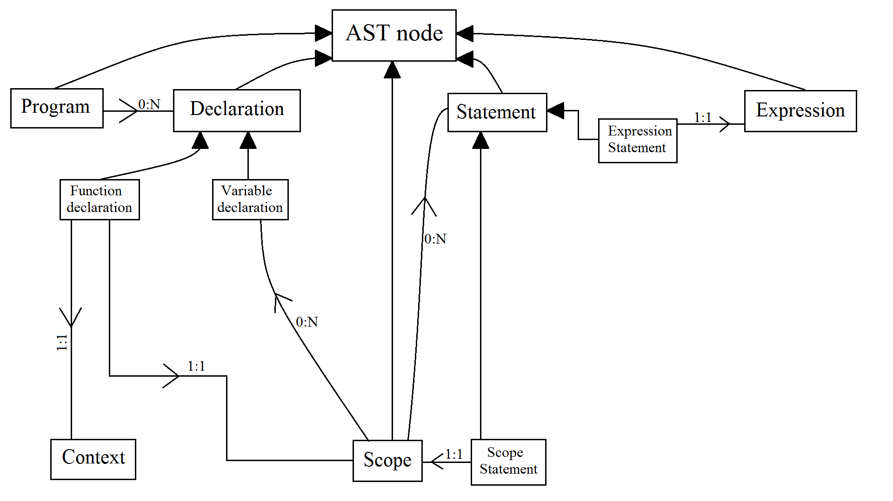
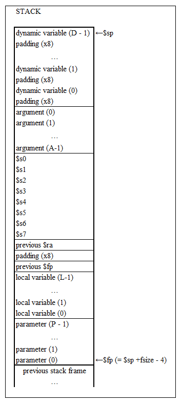

Documentation
=============

In total the documentation burden is (at most) 1000 words
plus one diagram. Assesment of the documentation is not relative
to compiler functionality, it just requires a description
of the compiler as-is, and a realistic assessment of the
compiler's strengths and weaknesses.

AST
===

Overview Diagram
----------------

Description
-----------

My AST separates code input in three different types: Declarations, Statements and Expressions. Declarations initialise variables and
functions, Statements affect the control flow of the program, and Expressions are used for arithmetic.

A Program is composed of 0 or more Declarations, but will only generate code for function definitions.

A Scope has Variable Declarations followed by Statements (thank you, C90 spec), and will inherit the variables declared in parent
Scopes, while deleting the variables it declared inside at the end of the Scope.

Some examples of Statements include: if and ifelse, while and for loops, assignments, and returns. Expression Statements
and Scope Statements have been added for convenience.

Expressions comprise binary expressions (add, mult...), unary expressions (i++, !i...), identifiers (to use variables), constants, and
funtion calls.

All of these classes inherit from AST node for ease of AST building.

Strengths
---------

### Strength 1

It is modular: I can change the attributes/code generation for one node without worrying about
affecting others.

### Strength 2

It is flexible: adding new components/nodes takes virtually no time or overhead.

Limitations
-----------

### Limitation 1

Global variables and local variables are analised in the same way.

### Limitation 2

Everything is based on the assumption that int is the only valid type.

Variable binding
================

General approach
----------------

Every function definition has an instance of the class Context, which will help with variable bindings, register allocation, and
stack management.

The Context keeps track of which registers are being used - which are only for expression calculations, and within my AST I can
always check for free registers to store temporary values, as every ASTnode->compile() takes in the current Context we are
working in.

The stack is also managed through the context, which keeps a record of the parameters available and variables intialised, amongst
other things. A simple diagram of the stack I implemented can be seen below.

There was an API in place to control variable bindings so all AST nodes could know where to load/store the relevant values:

  - Context.addVariable and Context.addParameter: save the variable/ parameter in a map indexed by name and with value 0-(N-1) where N is the total amount of parameters and variables initialised.
  
  - Context.isOnStack: returns whether the variable in question has been initialised before, aka if there is a space in the stack for it.
  
  - Context.findOnStack: returns a string like "42($sp)" that indicates where the variable requested is in the stack. This can be used for both lw and sw related instruction generation.

Strengths
---------

### Strength 1

I can store a near-infinite amount of variables, as they're all located in the stack and only loaded onto the registers when necessary.

### Strength 2

There is a location in the stack for dynamic variables, aka those initialised in scopes that will dissapear once the scope is over.

Limitations
-----------

### Limitation 1

Implementing arrays would probably be incredibly complex considering the current structure.

### Limitation 2

Memory allocation only works with integers (and maybe chars, although that hasn't been tested).

Reflection
==========

Strengths
---------

### Strength 1

The functionality implemented seems to work quite well (almost).

### Strength 2

It uses pseudo instructions for extra readibility of the output.

Scope for Improvement
---------------------

### Improvement 1

Finish implementing the code for global variables (just need to modify the Context class to include as variables and return where
they are w.r.t the global pointer).

### Improvement 2

Allow for function calls to pass more than 4 variables (through the stack, instead of with $a0-$a3).

Functionality (not assessed)
============================

Which of these features does your compiler support (insert
an `x` to check a box):

1 - [X] Local variables

2 - [X] Integer arithmetic

3 - [X] While

4 - [X] IfElse

5 - [X] For

6 - [X] Function calls

7 - [ ] Arrays

8 - [ ] Pointers

9 - [ ] Strings

10 - [ ] Structures

11 - [ ] Floating-point

Note that all features will be tested, regardless of what
appears here. This is documentation of what you expect to work,
versus what doesn't work.

Feedback (not assessed)
=======================

### Feedback 1

-

### Feedback 2

-

